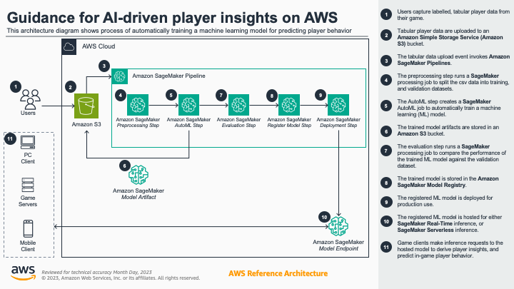

# Guidance for AI-driven player insights on AWS

## Table of Contents

1. [Overview](#overview)
    - [Architecture](#architecture)
    - [Cost](#cost)
2. [Prerequisites](#prerequisites)
    - [Operating System](#operating-system)
    - [Third-party tools](#third-party-tools)
    - [AWS account requirements](#aws-account-requirements)
    - [aws cdk bootstrap](#aws-cdk-bootstrap)
3. [Deployment Steps](#deployment-steps)
4. [Deployment Validation](#deployment-validation)
5. [Running the Guidance](#running-the-guidance)
    - [Player churn example](#player-churn-example)
    - [Player churn data](#player-churn-data)
    - [Player churn model](#player-churn-model)
    - [Player churn prediction](#player-churn-prediction)
6. [Cleanup](#cleanup)
7. [Next Steps](#next-steps)

## Overview

Game studios rely on a variety of key metrics to make informed, data-driven decisions that allow them to improve the overall player experience, and better understand their players. However, these studios usually lack the required skills, resources, and personal to effectively employ machine learning (ML) techniques to gleam these player insights. This guidance enables novice ML practitioners to extract predictive insights from their labeled, tabular player data, by leveraging automated machine learning (AutoML) to streamline the very manual, complex, and iterative processes of engineering data features, training ML models, tuning ML models, and evaluating ML models. By using this guidance, novice ML practitioners need only upload their labelled player data to __Amazon S3__, and the automated end-to-end workflow will generate a production grade model for predicting player behavior, and gaining player insights. Thereby eliminating the heavy lifting for the following tasks:

- Data exploration, with respect to the target column, to infer the ML problem type.
- Data preprocessing, and feature engineering for the inferred ML problem type.
- ML algorithm section for the inferred ML problem type.
- Ensemble model training to explore different model configurations, and find the best model for the inferred problem type.
- Evaluate the best model against a preset performance threshold.
- Deploy the evaluated model either as a hosted, or serverless endpoint.

### Architecture



### Cost

_You are responsible for the cost of the AWS services used while running this Guidance. As of January 2024, the cost for running this Guidance with the default settings in the N. Virginia AWS Region (us-east-1) is approximately $4.50 per end-to-end pipeline execution._

>__NOTE:__ The deployment automatically creates an [AWS cost allocation tag](https://docs.aws.amazon.com/awsaccountbilling/latest/aboutv2/cost-alloc-tags.html) based on the configured `WORKLOAD_NAME` variable in the `constants.py` file (see [Deployment Steps](#deployment-steps)). You can use the AWS Cost Explorer, and cost allocation tags to view the per month costs for each Amazon SageMaker Pipeline execution.

## Prerequisites

### Operating System

These deployment instructions are optimized to best work on a pre-configured **Amazon Linux 2023** [AWS Cloud9](https://aws.amazon.com/cloud9/) development environment.  Deployment using another OS may require additional steps, and configured python libraries(see [Third-party tools](#third-party-tools)).

>__NOTE:__ Refer to the [Individual user setup for AWS Cloud9](https://docs.aws.amazon.com/cloud9/latest/user-guide/setup-express.html) for more information on how to set up Cloud9 as the only user in the AWS Account.

### Third-party tools

Before deploying the guidance code, ensure that the following required tools have been installed:

- AWS Cloud Development Kit (CDK) >= 2.118
- Python >= 3.8
- NodeJS >= 18

>__NOTE:__ The Guidance has been tested using AWS CDK version 2.118. If you wish to update the CDK application to later version, make sure to update the `requirements.txt` file, in the root of the repository, with the updated version of the AWS CDK.

### AWS account requirements

This deployment requires that you have an existing [Amazon SageMaker Domain](https://docs.aws.amazon.com/sagemaker/latest/dg/sm-domain.html) in your AWS account. A SageMaker Domain is required in order to provide access to monitor, and track the following SageMaker resources:

- SageMaker AutoML 
- SageMaker Pipelines
- SageMaker Model Registry

>__NOTE:__ See the [Quick onboard to Amazon SageMaker Domain](https://docs.aws.amazon.com/sagemaker/latest/dg/onboard-quick-start.html) section of the __Amazon SageMaker Developer Guide__ for more information on how to configure an __Amazon SageMaker Domain__ in your AWS account.

### AWS CDK bootstrap

This Guidance uses AWS CDK. If you are using `aws-cdk` for first time, please see the [Bootstrapping](https://docs.aws.amazon.com/cdk/v2/guide/bootstrapping.html) section of the __AWS Cloud Development Kit (AWS CDK) v2__ developer guide, to provision the required resources, before you can deploy AWS CDK apps into an AWS environment.


## Deployment Steps

Before deploying the guidance code, it needs to be customized to suite your specific usage requirements. Guidance configuration, and customization, is managed using the `constants.py` file, located in the root of the repository. The following steps will walk you through how to customize the guidance code configuration to suite your use case, and then deploy the guidance code:

1. In the Cloud9 IDE, use the terminal to clone the repository:
    ```bash
    git clone https://github.com/aws-solutions-library-samples/guidance-for-ai-driven-player-insights-on-aws player-insights
    ```
2. Change to the repository root folder:
    ```bash
    cd player-insights
    ```
3. Initialize the Python virtual environment:
    ```bash
    python3 -m venv .venv
    ```
4. Activate the virtual environment:
    ```bash
    source .venv/bin/activate
    ```
5. Install the necessary python libraries in the virtual environment:
    ```bash
    python -m pip install -r requirements.txt
    ```
6. Open the `constants.py` file for editing. The following settings can be adjusted to suite your use case:
    - `WORKLOAD_NAME`
        - ___Description:___ The name of the workload that matches your use case. This will be used as a prefix for an component deployed in your AWS account.
        - ___Type:___ String
        - ___Example:___ `"PlayerChurn"`
    - `REGION`
        - ___Description:___ The name of the AWS region into which you want to deploy the use case.
        - ___Type:___ String
        - ___Example:___ `"us-east-1"`
    - `SM_DOMAIN_ID`
        - ___Description:___ The ID for your prerequisite __Amazon SageMaker Domain__ in your configured AWS region. You can view the ID for your domain in the [AWS Console](https://console.aws.amazon.com/sagemaker/), or by running the ```aws sagemaker list-domains --query "Domains[*].DomainId" --output text``` command.
        - ___Type:___ String
        - ___Example:___ `"d-abcdef12gh3i"`
    - `DATA_FILE`
        - ___Description:___ The name of the comma-separated values (CSV) file representing your player data.
        - ___Type:___ String
        - ___Example:___ `"player-churn.csv"`
    - `TARGET_ATTRIBUTE`
        - ___Description:___ The name of the target variable column of the `DATA_FILE` that you wish to train the machine learning model to predict on.
        - ___Type:___ String
        - ___Example:___ `"player_churn"`
    - `PERFORMANCE_THRESHOLD`
        - ___Description:___ The decision threshold, to indicate the wether or not the trained model is considered production grade. If the model evaluation metric is above or equal to this value, the model will be deployed into production.
        - ___Type:___ Float
        - ___Example:___ `0.5`
    - `ENDPOINT_TYPE`
        - ___Description:___ The type of inference endpoint for a production model, either `SERVERLESS` for [Amazon SageMaker Serverless Inference](https://docs.aws.amazon.com/sagemaker/latest/dg/serverless-endpoints.html), or `HOSTED` for [Amazon SageMAker Real-time Inference](https://docs.aws.amazon.com/sagemaker/latest/dg/realtime-endpoints.html).
        - ___Type:___ String
        - ___Example:___ `"SERVERLESS"`

    >__NOTE:__ Make sure to save the `constants.py` file after updating your use case settings.

7. Verify that the CDK deployment correctly synthesizes the proper CloudFormation templates:
    ```bash
    cdk synth
    ```
8. Deploy the guidance:
    ```bash
    cdk deploy
    ```

## Deployment Validation

To verify that the guidance has been successfully deployed, open the [AWS CLoudFormation Console](https://console.aws.amazon.com/cloudformation/), select the AWS region into which you deployed the guidance, and verify that the stack `<WORKLOAD_NAME>-Stack` has a `CREATE_COMPLETE` status. For example, if the `WORKLOAD_NAME` variable in the `constants.py` file is `PlayerChurn`, then the CloudFormation stack name is `PlayerChurn-Stack`.

>__NOTE:__ Make sure to capture the `DataBucketName` value from the __Output__ tab of the CloudFormation stack.

## Running the Guidance

The following example will demonstrate how to leverage the deployed guidance to create an end-to-end ML workflow to train, evaluate, and deploy an AutoML generated model, from player churn data.

### Player churn example 

Being able to identify , and predict player churn, as  in games is often a key metric, or valuable player insight that can be used  used to prevent player attrition. More importantly, identifying these players before they leave, or stop playing the game allows game developers to implement prescriptive solution that mitigate churn. However, detecting the various patterns, or factors that influence churn behavior, can be a difficult task for data analysts. Therefore, game developers look to employ ml-based prediction models, often requiring them to hire teams of qualified data scientists, to build, and manage these models in production.

### Player churn data

A synthetic sample data file of player event telemetry, [player-churn.csv](./assets/examples/player-churn.csv) has been provided. The dataset features various player metrics, like the `player_type`, `session_count`, and various session details over a period of a month, and classifies a player as "churned" if they have not logged into the game after 3 days. 

The following shows an example of this data:

| player_id | cohort_id | cohort_day_of_week | player_type | player_lifetime | session_count | player_churn | begin_session_count_last_day(-1) | end_session_count_last_day(-1) | begin_session_count_last_day(-2) | end_session_count_last_day(-2) | begin_session_count_last_day(-3) | end_session_count_last_day(-3) | begin_session_count_last_day(-4) | end_session_count_last_day(-4) | begin_session_count_last_day(-5) | end_session_count_last_day(-5) | begin_session_count_last_day(-6) | end_session_count_last_day(-6) | begin_session_count_last_day(-7) | end_session_count_last_day(-7) | begin_session_count_last_day(-8) | end_session_count_last_day(-8) | begin_session_count_last_day(-9) | end_session_count_last_day(-9) | begin_session_count_last_day(-10) | end_session_count_last_day(-10) | begin_session_count_last_week(-1) | end_session_count_last_week(-1) | begin_session_count_last_week(-2) | end_session_count_last_week(-2) | begin_session_count_last_week(-3) | end_session_count_last_week(-3) | begin_session_count_last_month(-1) | end_session_count_last_month(-1) | begin_session_count_last_month(-2) | end_session_count_last_month(-2) | begin_session_time_of_day_mean_last_day(-1) | end_session_time_of_day_mean_last_day(-1) | begin_session_time_of_day_mean_last_day(-2) | end_session_time_of_day_mean_last_day(-2) | begin_session_time_of_day_mean_last_day(-3) | end_session_time_of_day_mean_last_day(-3) | begin_session_time_of_day_mean_last_day(-4) | end_session_time_of_day_mean_last_day(-4) | begin_session_time_of_day_mean_last_day(-5) | end_session_time_of_day_mean_last_day(-5) | begin_session_time_of_day_mean_last_day(-6) | end_session_time_of_day_mean_last_day(-6) | begin_session_time_of_day_mean_last_day(-7) | end_session_time_of_day_mean_last_day(-7) | begin_session_time_of_day_mean_last_day(-8) | end_session_time_of_day_mean_last_day(-8) | begin_session_time_of_day_mean_last_day(-9) | end_session_time_of_day_mean_last_day(-9) | begin_session_time_of_day_mean_last_day(-10) | end_session_time_of_day_mean_last_day(-10) | begin_session_time_of_day_mean_last_week(-1) | end_session_time_of_day_mean_last_week(-1) | begin_session_time_of_day_mean_last_week(-2) | end_session_time_of_day_mean_last_week(-2) | begin_session_time_of_day_mean_last_week(-3) | end_session_time_of_day_mean_last_week(-3) | begin_session_time_of_day_mean_last_month(-1) | end_session_time_of_day_mean_last_month(-1) | begin_session_time_of_day_mean_last_month(-2) | end_session_time_of_day_mean_last_month(-2) | begin_session_time_of_day_std_last_day(-1) | end_session_time_of_day_std_last_day(-1) | begin_session_time_of_day_std_last_day(-2) | end_session_time_of_day_std_last_day(-2) | begin_session_time_of_day_std_last_day(-3) | end_session_time_of_day_std_last_day(-3) | begin_session_time_of_day_std_last_day(-4) | end_session_time_of_day_std_last_day(-4) | begin_session_time_of_day_std_last_day(-5) | end_session_time_of_day_std_last_day(-5) | begin_session_time_of_day_std_last_day(-6) | end_session_time_of_day_std_last_day(-6) | begin_session_time_of_day_std_last_day(-7) | end_session_time_of_day_std_last_day(-7) | begin_session_time_of_day_std_last_day(-8) | end_session_time_of_day_std_last_day(-8) | begin_session_time_of_day_std_last_day(-9) | end_session_time_of_day_std_last_day(-9) | begin_session_time_of_day_std_last_day(-10) | end_session_time_of_day_std_last_day(-10) | begin_session_time_of_day_std_last_week(-1) | end_session_time_of_day_std_last_week(-1) | begin_session_time_of_day_std_last_week(-2) | end_session_time_of_day_std_last_week(-2) | begin_session_time_of_day_std_last_week(-3) | end_session_time_of_day_std_last_week(-3) | begin_session_time_of_day_std_last_month(-1) | end_session_time_of_day_std_last_month(-1) | begin_session_time_of_day_std_last_month(-2) | end_session_time_of_day_std_last_month(-2) |
|---|---|---|---|---|---|---|---|---|---|---|---|---|---|---|---|---|---|---|---|---|---|---|---|---|---|---|---|---|---|---|---|---|---|---|---|---|---|---|---|---|---|---|---|---|---|---|---|---|---|---|---|---|---|---|---|---|---|---|---|---|---|---|---|---|---|---|---|---|---|---|---|---|---|---|---|---|---|---|---|---|---|---|---|---|---|---|---|---|---|---|---|---|---|---|---|---|
| 97cea075a9954326bb0c71b31fcab437 | 2022_06_08 | 2 | churner | 97891.783281 | 2 | False | 1 | 1 | 1 | 1 | 0 | 0 | 0 | 0 | 0 | 0 | 0 | 0 | 0 | 0 | 0 | 0 | 0 | 0 | 0 | 0 | 2 | 2 | 0 | 0 | 0 | 0 | 2 | 2 | 0 | 0 | 69078.272027 | 76150.867241 | 64659.083961 | 71881.314174 | 0 | 0 | 0 | 0 | 0 | 0 | 0 | 0 | 0 | 0 | 0 | 0 | 0 | 0 | 0 | 0 | 23668.677994 | 30816.090708 | 0 | 0 | 0 | 0 | 23668.677994 | 30816.090708 | 0 | 0 |  |  |  |  | 0 | 0 | 0 | 0 | 0 | 0 | 0 | 0 | 0 | 0 | 0 | 0 | 0 | 0 | 0 | 0 | 64218.863743 | 64113.05582 | 0 | 0 | 0 | 0 | 64218.863743 | 64113.05582 | 0 | 0 |
| 56d4b533b42740e990ce0aac3bdfcfc6 | 2022_06_08 | 2 | churner | 78252.746837 | 2 | False | 2 | 2 | 0 | 0 | 0 | 0 | 0 | 0 | 0 | 0 | 0 | 0 | 0 | 0 | 0 | 0 | 0 | 0 | 0 | 0 | 2 | 2 | 0 | 0 | 0 | 0 | 2 | 2 | 0 | 0 | 15081.716635 | 22274.939247 | 0.0 | 0.0 | 0 | 0 | 0 | 0 | 0 | 0 | 0 | 0 | 0 | 0 | 0 | 0 | 0 | 0 | 0 | 0 | 15081.716635 | 22274.939247 | 0 | 0 | 0 | 0 | 15081.716635 | 22274.939247 | 0 | 0 | 50229.649963 | 50263.69293 | 0.0 | 0.0 | 0 | 0 | 0 | 0 | 0 | 0 | 0 | 0 | 0 | 0 | 0 | 0 | 0 | 0 | 0 | 0 | 50229.649963 | 50263.69293 | 0 | 0 | 0 | 0 | 50229.649963 | 50263.69293 | 0 | 0 |
| 16ca20d622c04f96971ac359cd8f4151 | 2022_06_08 | 2 | churner | 161992.623939 | 3 | False | 2 | 2 | 1 | 1 | 0 | 0 | 0 | 0 | 0 | 0 | 0 | 0 | 0 | 0 | 0 | 0 | 0 | 0 | 0 | 0 | 3 | 3 | 0 | 0 | 0 | 0 | 3 | 3 | 0 | 0 | 18328.872222 | 25516.40685 | 73935.322063 | 81085.45611 | 0 | 0 | 0 | 0 | 0 | 0 | 0 | 0 | 0 | 0 | 0 | 0 | 0 | 0 | 0 | 0 | 65664.355502 | 72839.42327 | 0 | 0 | 0 | 0 | 65664.355502 | 72839.42327 | 0 | 0 | 53215.18547 | 53190.74877 |  |  | 0 | 0 | 0 | 0 | 0 | 0 | 0 | 0 | 0 | 0 | 0 | 0 | 0 | 0 | 0 | 0 | 77421.168823 | 77431.646079 | 0 | 0 | 0 | 0 | 77421.168823 | 77431.646079 | 0 | 0 |
| e14c495dc6544134bd51e7eb7bfd91f4 | 2022_06_08 | 2 | churner | 89544.033403 | 2 | False | 1 | 2 | 1 | 0 | 0 | 0 | 0 | 0 | 0 | 0 | 0 | 0 | 0 | 0 | 0 | 0 | 0 | 0 | 0 | 0 | 2 | 2 | 0 | 0 | 0 | 0 | 2 | 2 | 0 | 0 | 76617.072141 | 42513.73832 | 80601.831075 | 0.0 | 0 | 0 | 0 | 0 | 0 | 0 | 0 | 0 | 0 | 0 | 0 | 0 | 0 | 0 | 0 | 0 | 35409.451608 | 42513.73832 | 0 | 0 | 0 | 0 | 35409.451608 | 42513.73832 | 0 | 0 |  | 58311.032016 |  | 0.0 | 0 | 0 | 0 | 0 | 0 | 0 | 0 | 0 | 0 | 0 | 0 | 0 | 0 | 0 | 0 | 0 | 58276.37583 | 58311.032016 | 0 | 0 | 0 | 0 | 58276.37583 | 58311.032016 | 0 | 0 |

### Player churn model

As you can see, the `player_churn` attribute of the example data, is the variable we want the ML model to predict. To automatically train, evaluate, and deploy an ML that predicts this variable, perform the following steps:

1. Upload the example data, `./assets/examples/player-churn.csv` to the S3 Bucket created by the deployment:
    ```bash
    export ACCOUNT=$(aws sts get-caller-identity --query Account --output text)
    export REGION=$(aws configure get region)
    export WORKLOAD=$(python -c "import constants; print(constants.WORKLOAD_NAME.lower())")
    export BUCKET=s3://$WORKLOAD-data-$REGION-$ACCOUNT
    aws s3 cp ./assets/examples/player-churn.csv $BUCKET/raw-data/player-churn.csv
    ```
2.  Open __SageMaker Studio Classic__ IDE, and view the __SageMaker Pipelines__ execution. The pipeline is named after the `WORKLOAD_NAME` variable in the `constants.py` file, e.g. `PlayerChurn-AutoMLPipeline`.

>__NOTE:__ For more information on how to view the pipeline execution, see the [View, Track, and Execute SageMaker Pipelines in SageMaker Studio](https://docs.aws.amazon.com/sagemaker/latest/dg/pipelines-studio.html) section of the __Amazon SageMaker__ developer guide.

The pipeline should take approximately 40 minutes to run, and should look as follows once complete:


To review the best model candidates, that are automatically generated during the `AutoMLTrainingStep` of the __SageMaker Pipeline__, perform the following steps:

1. Using the __SageMaker Studio Classic__ IDE, view the __SageMaker Pipelines__ execution, and select the `AutoMLTrainingStep` of the pipeline. 
2. Select the `Details` tab for the step and review the `Job name` of the `Information` section. 
3. Select the __AutoML__ option in the studio IDE navigation panel, and click on the name of the __Autopilot__ job that matches the `Job name` from the pipeline step.
4. Review the various automated trails and the respective model details, by clicking on each `Trial name`.


>__NOTE:__ For more information on model details, see the [View model details](https://docs.aws.amazon.com/sagemaker/latest/dg/autopilot-models-details.html) section of the __Amazon SageMaker__ developer guide.


### Player churn prediction

A test script, `inference_test.py`, has been provided to test deriving player churn insights from the deployed model. To execute the test on a sample data, run the following:

1. Change to the `assets` folder:
    ```bash
    cd asset/test
    ```
2. Run the test script, supplying the name of the workload endpoint. For example, if the `WORKLOAD_NAME` variable in the `constants.py` file is `PlayerChurn`, then the SageMaker Endpoint name is `PlayerChurn-Endpoint`
    ```bash
    python churn_inference.py --endpoint-name PlayerChurn-Endpoint
    ```

The output from the test script should look as follows:

```text
Using SageMaker Endpoint: PlayerChurn-Endpoint
Sending inference request with test payload ...
SageMaker returned the following response: False
```

As you can see, the deployed player churn model predicts that, based on the sample player event data, this sample player is __NOT__ predicted to leave the game.

## Cleanup

There are two options for deleting the deployed guidance:

1. Using the AWS console
    - Open the [AWS CloudFormation console](https://console.aws.amazon.com/cloudformation/), and select the AWS region into which you have deployed the guidance.
    - Select the radio button for the deployed stack, e.g. `PlayerChurn-Stack`.
    - Click the __Delete__ button to start the stack deletion.
    - Click the __Delete__ to confirm stack deletion.

2. Using the CDK CLI
    - Using the Cloud9 terminal window, change to the root of the cloned repository:
        ```bash
        cd ~/environment/player-insights
        ```
    - Run the command to delete the CloudFormation stack:
        ```bash
        cdk destroy
        ```
    - When prompted, `Are you sure you want to delete`, enter `y` to confirm stack deletion.

>__NOTE:__ Deleting the deployed resources will not delete the __Amazon S3__ bucket, in order to protect any training data already stored. See the [Deleting a bucket](https://docs.aws.amazon.com/AmazonS3/latest/userguide/delete-bucket.html) section of the __Amazon Simple Storage Service__ user guide for the various ways to delete the S3 bucket.

## Next Steps

Each deployment of the guidance is specific to a unique business case, and the supporting labeled dataset. For each use case, update the `constants.py` with the variables specific to the use case and the dataset, and then deploy the CDK application, as shown in the [Deployment Steps](#deployment-steps) section.

To update, and generate a newer version of the deployed model with newer data, simply add the updated dataset to the __Amazon S3__ bucket. The __SageMaker Endpoint__ will be automatically updated with the newer version of the best model.